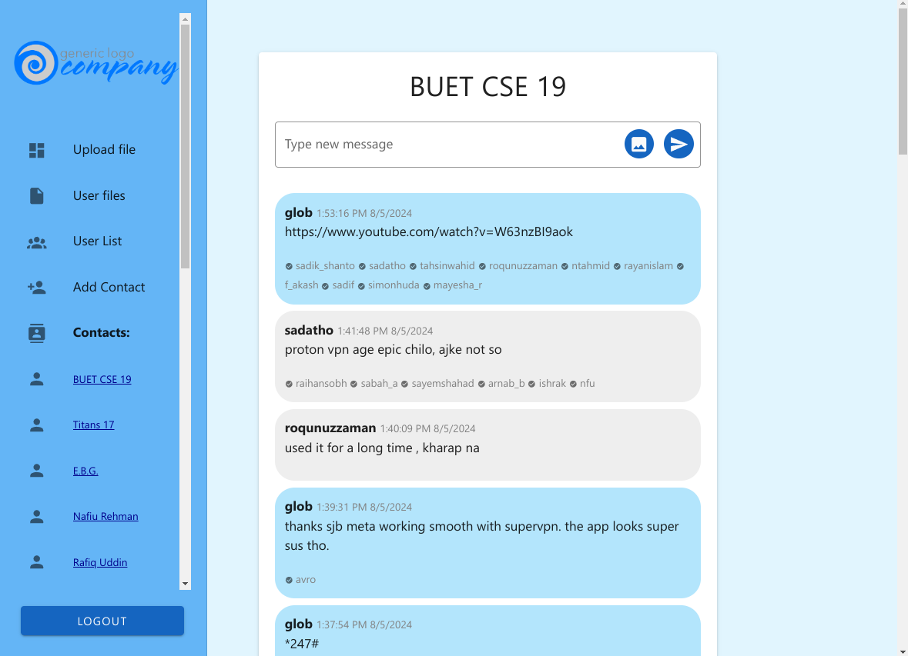
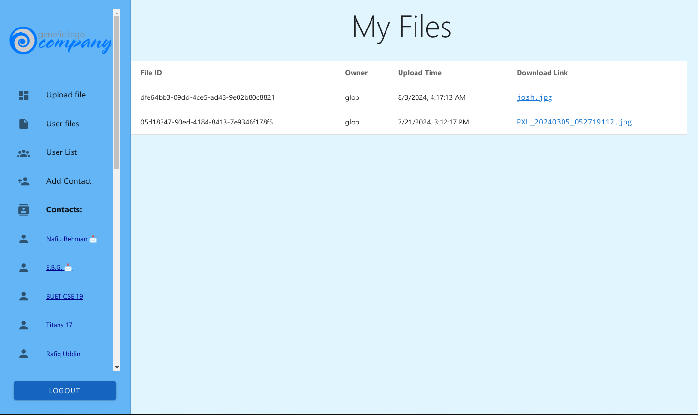
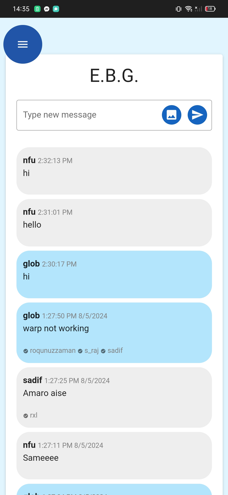
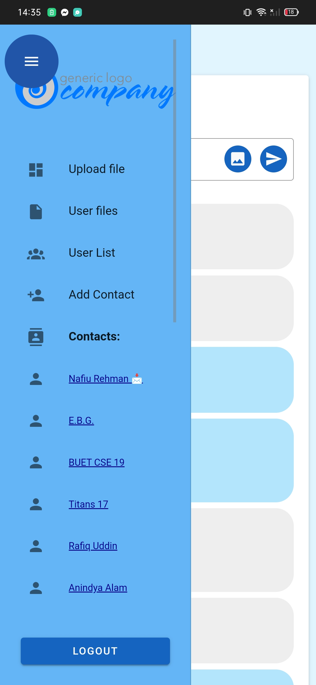
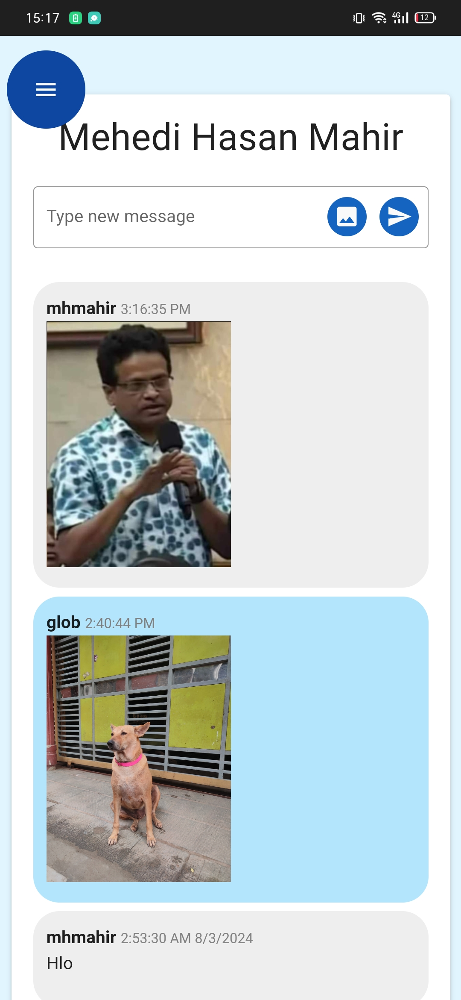

# EmergencyChat

EmergencyChat is a simple web chat and file-sharing platform for both mobile and desktop. It was developed to get around the government-enforced internet outage in Bangladesh during the crisis of July-August 2024.

## Features
- Direct messaging between contacts
- Group chats
- Unread notifications
- Read receipts
- File uploads and sharing
- Image sharing in chat

## Development Stack
- **Frontend**: Svelte
- **Backend**: Node.js, Express.js
- **Database**: PostgreSQL

## Previews 

  
  
  

